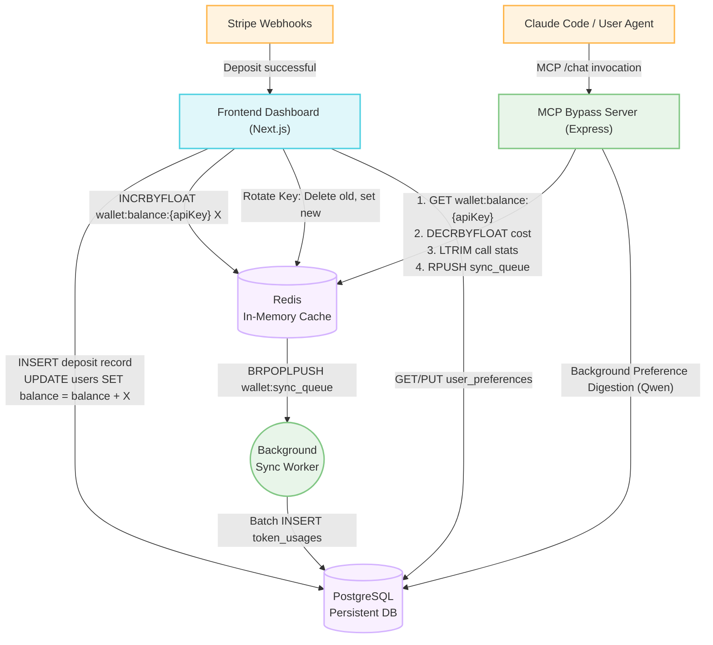

# System Architecture & Technical Schema

This schema outlines the integration architecture between the MCP Frontend Billing Dashboard, the MCP Bypass Backend Server, and the persistence layer (Redis & PostgreSQL).

## Architecture Diagram

## Responsibility Matrix

### 1. Frontend (Billing Dashboard)
The Frontend acts as the authoritative source for **deposits, key rotation, and explicit user preference management**.
* **Stripe Integrations**: Listens to Stripe checkout sessions and processes real money deposits.
* **Database Updates**: Modifies `users.balance` in Postgres by strictly incrementing it (deposits only). It never deducts from Postgres.
* **Redis Synchronization**: Pushes the deposit delta to Redis via `INCRBYFLOAT wallet:balance:{apiKey} <amount>` so the backend sees the new funds instantly.
* **Key Management**: When a user rotates their API key, the frontend transfers the Redis balance/stats to the new key, deletes the old key, and then updates Postgres.
* **Preference Management**: The frontend directly queries and allows manual user editing of the `user_preferences` table in Postgres via its own API endpoints.

### 2. Redis (The "Hot" State)
Redis acts as the **sole source of truth for real-time validation**.
* **Balance Enforcement**: Holds `wallet:balance:{apiKey}`. If this key is missing or `<= 0`, the backend rejects requests.
* **Call Logging**: Maintains a capped list (`LTRIM 0 499`) of the last 500 API calls per user for instant dashboard analytics.
* **Sync Queue**: Acts as a buffer `wallet:sync_queue` for API usage events that need to be permanently recorded in Postgres.

### 3. MCP Backend (Inference Proxy)
The Backend acts as the high-throughput inference proxy, **consumer of funds**, and **implicit context manager**.
* **Pre-flight Balance Check**: Before invoking DeepInfra, the backend checks if `wallet:balance:{apiKey} > 0`. If the wallet is empty, the tool returns a specific error instruction to the calling agent (e.g. Claude Code) instructing it to notify the user that a top-up is required.
* **Post-Response Atomic Deduction**: Since the final cost depends on both input and output tokens, the actual balance deduction occurs *after* the DeepInfra response is received. A single atomic Lua script deducts the cost (allowing the balance to drop slightly below zero if this was their final call), logs the call, and queues the sync.
* **Implicit Context Digestion**: During an `extra_think` tool invocation, the backend pulls the `user_preferences` from Postgres, feeds them into the system prompt, and simultaneously kicks off a lightweight background process (using Qwen) to digest the user's prompt for new preferences. If detected, it updates Postgres asynchronously.
* **Zero DB Validation**: Does not query Postgres during a live request to validate the user or key (eliminating race conditions during key rotation).
* **Write-Behind Caching**: A background worker continuously pops items off the Redis `wallet:sync_queue` and inserts permanent `token_usages` records into Postgres.
* **No Postgres Balance Updates**: The backend *never* issues an `UPDATE users SET balance` to Postgres. It only deducts from Redis.

### 4. PostgreSQL (The "Cold" Analytics & Context State)
Postgres acts as the permanent ledger and contextual memory store.
* **Financial Ledger**: `users.balance` represents total historical deposits.
* **Usage Ledger**: `token_usages` represents permanent, immutable records of every AI call made.
* **User Context**: `user_preferences` stores a JSONB blob of the user's implicit and explicit preferences, accessible by both the frontend dashboard and the backend inference pipeline.

* **Audit Trail**: Discrepancies can be audited by comparing the total deposits (`users.balance`) minus the sum of all usage costs (`token_usages.cost`), which should equal the current real-time `wallet:balance:{apiKey}` in Redis.

